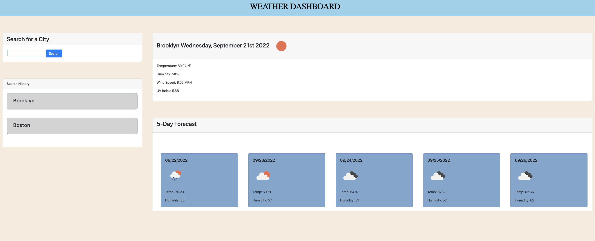
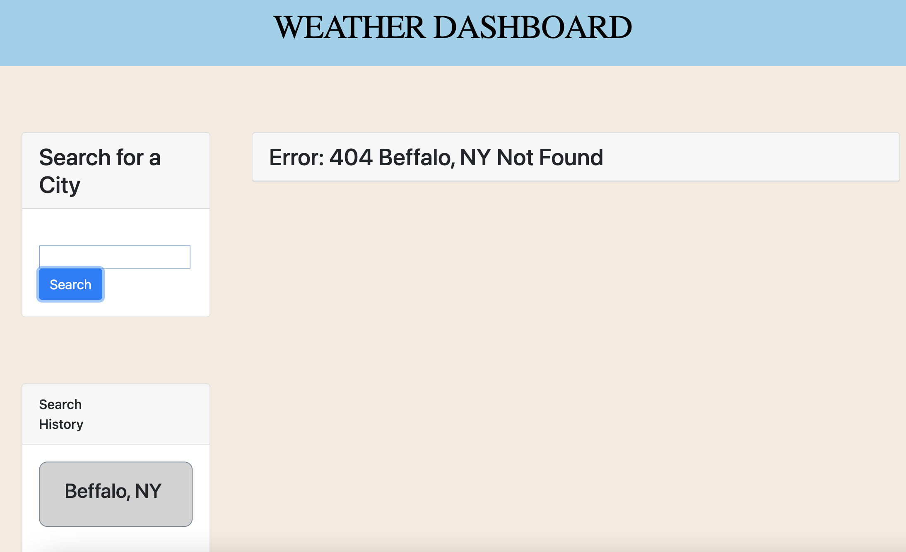

# WorkDayScheduler
Creating a simple five (5) day weather application that allows a user to view five day weater based on there query city. This application will use Third-party APIs to OpenWeather One Call API to retrieve weather data for cities. Third-party APIs allow developers to access their data and functionality by making requests with specific parameters to a URL.
User run in the browser and feature dynamically updated HTML and CSS powered by jQuery.


# Deployed URL
https://kabirfaisal1.github.io/FiveDayWeather/
### Open Deployed URL from terminal
 open -a 'google chrome' https://kabirfaisal1.github.io/FiveDayWeather/


# Folder structure 
1. root will have 'index.html' file which will be the main application
2. cssStyle will have 'style.css' file which will controls style and layout web pages
3. jsScript will have 'script.js' file which will controls user interaction and validate the workflow of the application

# How to Open the app-

 ### local

 Open terminal

 #### clone
 ```
 git clone https://github.com/kabirfaisal1/FiveDayWeather.git
 ```
 #### Open index.html
 ```
 open -a 'google chrome' <filepath>/FiveDayWeather/index.html
 ```
# User Story

```
AS A traveler
I WANT to see the weather outlook for multiple cities
SO THAT I can plan a trip accordingly
```

# Acceptance Criteria
```
GIVEN a weather dashboard with form inputs
WHEN I search for a city
THEN I am presented with current and future conditions for that city and that city is added to the search history
WHEN I view current weather conditions for that city
THEN I am presented with the city name, the date, an icon representation of weather conditions, the temperature, the humidity, and the wind speed
WHEN I view future weather conditions for that city
THEN I am presented with a 5-day forecast that displays the date, an icon representation of weather conditions, the temperature, the wind speed, and the humidity
WHEN I click on a city in the search history
THEN I am again presented with current and future conditions for that city
```


## App Screenshots





